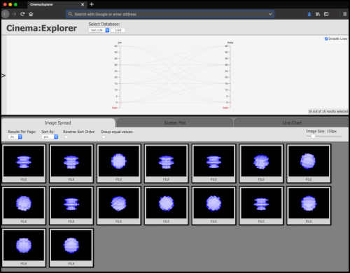

# Cinema Scratch

A set of in-progress scripts and modules. To run the tests:

```
    cd src
    python -m unittest discover testing
```

## Examples 

<p align="center">
    
</p>
<p align="center">Screen capture of the result of this example.</p>

- `test_generate` This is an example of how to generate a cinema phi/theta database from a vtk pipeline and render window.
